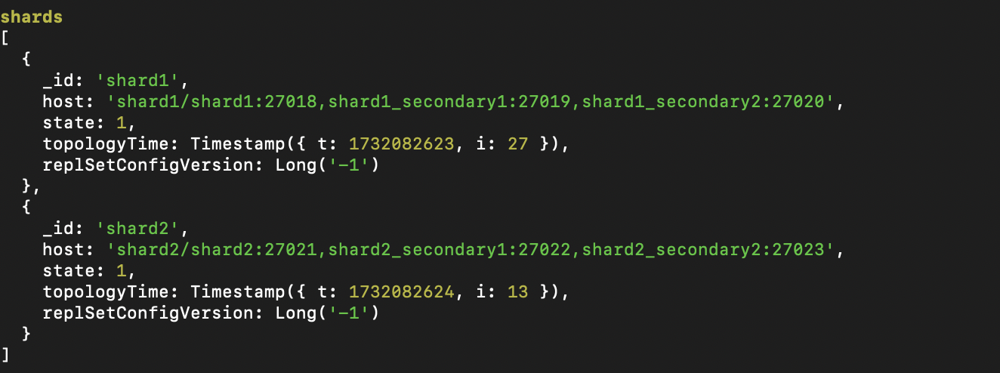

# Диаграммы

Схема в DrawIO: [Sharding+Replica+Cache](https://viewer.diagrams.net/?tags=%7B%7D&lightbox=1&highlight=0000ff&edit=_blank&layers=1&nav=1&title=task1.drawio&page-id=K09xfL7D1OvWVFMjcOQ0#Uhttps%3A%2F%2Fdrive.google.com%2Fuc%3Fid%3D1TAPihBj_CPJNd-V3agdpqP5-weSMhgB4%26export%3Ddownload)

Ссылка на файл: https://drive.google.com/file/d/1TAPihBj_CPJNd-V3agdpqP5-weSMhgB4/view?usp=sharing

# pymongo-api

## Как запустить

Запускаем mongodb и приложение

```shell
docker compose up -d
```

Настраиваем шардирование: роутер, сервер конфигурации, шарды и реплики
```shell
sh ./scripts/setup_sharding.sh
```

Можно сделать проверку подключившись к роутеру
```shell
docker exec -it mongos_router mongosh --port 27024 --eval "sh.status();"
```




Заполняем mongodb данными

```shell
sh ./scripts/setup_data.sh
```

## Как проверить

### Если вы запускаете проект на локальной машине

Откройте в браузере http://localhost:8080

### Если вы запускаете проект на предоставленной виртуальной машине

Узнать белый ip виртуальной машины

```shell
curl --silent http://ifconfig.me
```

Откройте в браузере http://<ip виртуальной машины>:8080

## Доступные эндпоинты

Список доступных эндпоинтов, swagger http://<ip виртуальной машины>:8080/docs


### Чтобы проверить сколько записи распределены по шардам

Подключаемся к роутеру

```shell
docker exec -it mongos_router mongosh --port 27024 
use somedb;
db.helloDoc.getShardDistribution();

```

Для проверки кэша заходим /docs и проверяем запросы, после первого запроса должны ходить быстрее